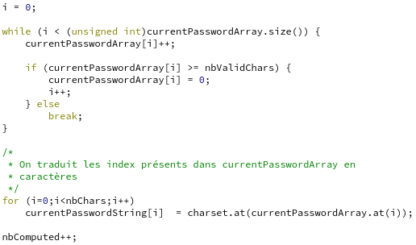
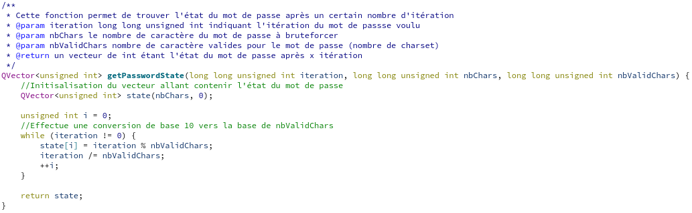
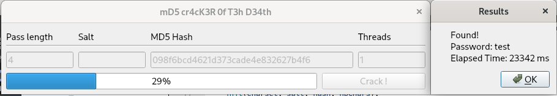
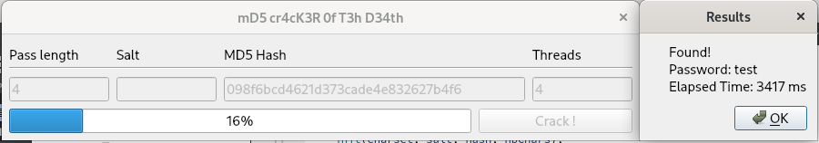
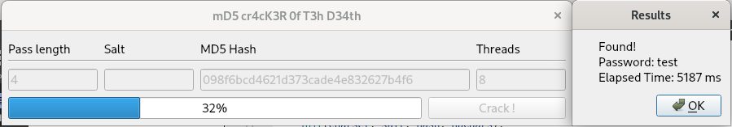
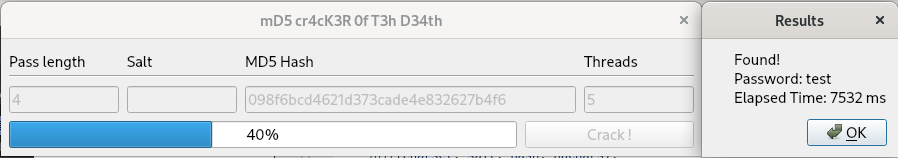
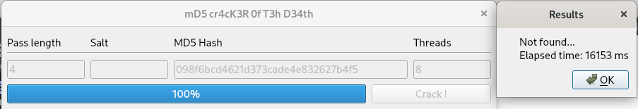
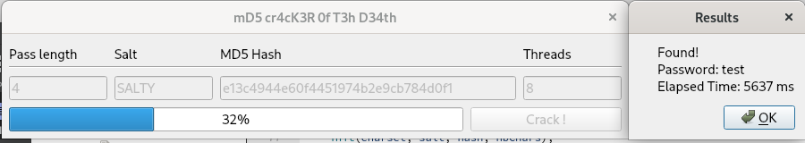
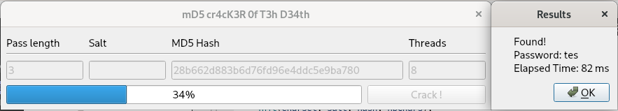

# Labo 3 : Cracking md5

Auteurs: Müller Robin, Teixeira Carvalho Stéphane

## Description des fonctionnalités du logiciel

Lors de ce laboratoire, il nous a été demandés d'implémenter du multi-threading dans une application de crackage de mot de passe md5.  
 Il a fallu implémenter cela car, l'application était fonctionnelle mais avait des problèmes de performances et donc avec un programme multi-threadé il était possible de fortement améliorer son fonctionnement.

 Au lieu d'avoir un seul thread pour cracker nous aurions plusieurs threads se partageant les essais pour effectuer le crackge plus rapidement.

Le logiciel fonctionne en donnant la taille du mot de passe ainsi que le sel et le hash correspondant à celui-ci. Il est ensuite possible de définir le nombre de threads que nous voulons utiliser pour cracker le mot de passe.

Une barre de progression est également affichée. Elle permet d'indiquer le pourcentage de mot de passe essayé.

## Choix d'implémentation

Nous avons initialement implémenter une première version avec comme optique de faire que chaque threads effectue l'un après l'autre le test de hash. Avec ce choix, nous avons du mettre en place un mutex pour permettre aux threads de ne pas rentrer dans la zone critique en même temps. La zone critique est l'incrémentation du vecteur d'entier contenant le mot de passe, ainsi que la transformation en chaine de caractères. Chaque thread devait connaître l'état actuel du mot de passe(`currentPasswordArray`) a essayer ainsi que le nombre d'essai effectuer(`nbComputed`)

Étant donné que la section est grande et qu'elle contient deux boucles, le crackage de hash était de plus en plus lent, en augmentant le nombre de threads. Cela venait du fait que le zone ne pouvait être accédée que par un thread à la fois.

Nous avons donc changé d'optique et nous nous sommmes concentrés sur de la parallélisation plutôt que d'avoir une section critique. Pour cela, nous avons décidé de séparer l'espace de crackage de chaque thread. Par exemple, si nous avons 1000 différentes possibilités de mot de passe ainsi que 5 threads, le thread 1 crackera les mots de passe aux indexes 0 à 199, puis 200 à 399, etc...

Le problème de cette optique est de trouver en un temps raisonnable l'état du mot passe à un certain index.
Afin de déterminer cela, nous nous sommes rendu compte que c'était simplement un problème de conversion de base, de la base 10 à la base `nbValidChars`. `nbValidChars` correspond aux nombres de caractères du charset, qui est de 66 (abcdefghijklmnopqrstuvwxyzABCDEFGHIJKLMNOPQRSTUVWXYZ1234567890!$~\*). La complexité de l'algorithme est donc **lognbValidChars(n)**.

Voici le code pour la conversion :

Notre solution augmente la vitesse d'un facteur `n`, n étant le nombre de threads, si l'on ne trouve pas le mot de passe et que les threads vont à la même vitesse.

Nous avons remarqué que si l'on essaie de cracker le même hash avec un nombre de threads différents, il est possible que le temps augmente ou diminue. Cette variation est causée par la séparation de l'espace de crackage. On peut voir ce résultat dans les tests du point 2.

## Tests effectués
Pour les tests effectués, nous avons utilisé le mot de passe `test`, sans sel, qui correspond au hash suivant : `098f6bcd4621d373cade4e832627b4f6`. Nous avons fais les test avec un mot de passe de 4 caractères car avec plus nous obtenions des temps beacoup trop long pour effectuer des tests.

1. Choix d'un mot de passe de 4 caractères et tentative de cassage avec 1 thread. Cela permet de vérifier que notre implémentation fonctionne comme le programme de base.

  **Résultat :** Le résultat reste identique au programme de base. Le mot de passe est trouvé au même moment(29%).

  

2. Choix d'un mot de passe de 4 caractères et tentative de cassage avec plusieurs thread.

  **Résultat :** Le mot de passe est trouvé plus rapidement que lors du test précédent.

  

  1. Nous augmentons ici le nombre de thread à 8

    **Résultat :** Nous avons ici le problème que nous avions cité auparavant ou il est possible que le temps de crackge soit plus élévé avec plus de thread. Ici le mot de passe doit se situé vers la millieu de test d'un des threads.

    

  2. Nous augmentons ici le nombre de thread à 5

      **Résultat :** Tout comme le test précédent nous avons une augmentation du temps de recherche.

      

3. Choix d'un mot de passe de 4 caractères avec un hash faussé.

  **Résultat :** Le mot de passe n'est effectivement pas trouvé et lorsque 100% est atteint le programme affiche le message directement. Cela nous confirme donc que tout nos threads se terminent correctement.

  

4. Choix d'un mot de passe de 4 caractères avec un sel.
  Le sel utilisé est `SALTY`, le mot de passe `test` et le hash corresondant `e13c4944e60f4451974b2e9cb784d0f1`

  **Résultat :** Dans ce test, le crackage est en peut plus lent mais cela est dû au sel. Le mot de passe est trouvé en un temps raisonnable.

  

5. Choix d'un mot de passe de 3 caractères.
  Le mot de passe est `tes` et le hash correspondant est `28b662d883b6d76fd96e4ddc5e9ba780`.

  **Résultat :** Le mot de passe est trouvé encore plus rapidement que dans le programme de base.

  
