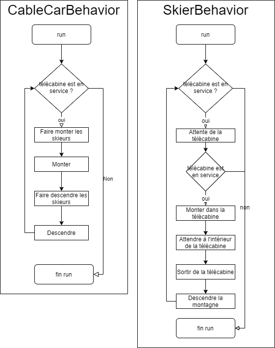

# Labo 4 : Telecabine

Auteurs: Müller Robin, Teixeira Carvalho Stéphane

## Description des fonctionnalités du logiciel

Lors de ce laboratoire, il nous a été demandé d'implémenter de la synchronisation à l'aide de sémaphore dans une application de simulation de télécabine.  

Il a fallu implémenter cela car le système qui nous a été donné est construit de telle sorte à avoir un ensemble de `N` thread qui seront les skieurs et d'un thread qui représentera la télécabine.  

La cabine fera monter des skieurs sur la piste et ils descendront alors la piste chacun à leur rythme. Les threads n'arriveront donc pas forcément en même temps. La télécabine, une fois tous les skieurs déchargés, effectuera le trajet de retour à la station pour prendre plus de skieurs. Ce trajet s'effectue avec la cabine vide s'il n'y a aucun skieurs en attente.

La télécabine ne pourra pas supporter plus de `M` skieurs.
Une fois toutes les places prises, les skieurs attendront la prochaine remontée. Ils devront donc attendre leur tour.

Si la télécabine termine son service et que des skieurs sont en attente ils ne pourront pas effectuer la montée, ils rentrent.

Lorsque la fin de service est annoncé la cabine si elle se préparait à monter charge les skieurs et effectue la montée puis elle décharge des skieurs et redescends puis s'arrête.  
Sinon si elle était en descente elle s'arrête à la fin de la descente.

Il est possible de voir d'après les explications ci-dessus qu'il faut effectivement implémenter de la synchronisation entre les threads de par le fait que les skieurs ne peuvent pas descendre la montagne sans avoir pris la télécabine ou encore qu'il ne peuvent pas monter à plus de `M` personnes etc...

## Choix d'implémentation

En prenant en compte les fonctionnalités que le problème expliqué ci-dessus comporte, voici comment nous avons implémenté la solution à ce problème.

Dans un premier temps nous avons décidé du comportement de la télécabine et des skieurs. Voici 2 flowchart expliquant le fonctionnement.



Si nous commençons par la `télécabine` son comportement est très basique si elle est en service elle fait monter et descendre des skieurs. Même si aucun skieurs n'est présent lors de l'arrivée de la télécabine celle-ci montera quand même.

Pour que la `télécabine` effectue la remontée il faut que tout les skieurs qu'elle va monter aient fini de monter dans la télécabine.

Une fois que la `télécabine` a montée, elle doit faire descendre tous ces skieurs avant de pouvoir redescendre. Une fois tous les skieurs hors de la télécabine celle-ci descend et le cycle recommence.

Si nous prenons maintenant les `skieurs`, on sait que si la cabine est en service, il doit attendre la télécabine car celle-ci pourrait être en haut de la montagne ou effectue une montée ou encore une descente.  
Une fois que la télécabine arrive le `skieur` doit à nouveau vérifier que la télécabine est en service car cela pouvait être sa dernière remontée et donc elle ne remontera plus. Dans ce cas le comportement du skieurs est stoppé.

Par contre, si la télécabine est en service, le skieur va alors monter dans celle-ci puis, attendre à l'intérieur le temps que les autres skieurs montent dans la télécabine et que la montée se termine. Une fois la montée terminée, il va sortir de la télécabine et descendre la montagne.

Nous n'avons bien sûr pas encore démontré comment nous avons implémenter la synchronisation car ici le but est d'expliquer simplement le comportement que nous voulons des 2 classes néanmoins nous pouvons déjà voir que la `télécabine` et les `skieurs` auront besoin de signaux pour arrêter leur exécution ou la reprendre.

Une fois les comportements mis en place nous avons implémenté la classe `PcoCableCar.cpp`.

Pour l'implémentation des différents fonctionnements et la synchronisation entre threads nous avons utilisés 4 sémaphores.

```cpp
PcoSemaphore cableCarLoad;
PcoSemaphore cableCarUnload;
PcoSemaphore skieurInside;
PcoSemaphore skieurOutside;
PcoSemaphore mutex = PcoSemaphore(1);
```

La première sémaphore `cableCarLoad` va permettre à un skieurs de faire une demande(`acquire`) pour monter dans la télécabine lorsque un skieur attendra la télécabine(`waitForCableCar`). Cette sémaphore nous permet également de maintenir les demandes d'accès des skieurs dans l'ordre grâce à la FIFO mise en place dans la conception de sémaphore.  
Les demandes seront ensuite accepté(`release`) lorsque que la télécabine fera monter les skieurs.

La deuxième sémaphore `cableCarUnload` permet à un skieur de faire une demande pour descendre de la télécabine. Ainsi tant que la télécabine ne permet pas au skieur de descendre(`release`) celui-ci attends à l'intérieur de la télécabine(`waitInsideCableCar`).

La sémaphore `skieurInside` permet à la télécabine de faire monter un skieur à la fois. La télécabine va indiquer au skieurs que celui-ci peut monter(`acquire`) et une fois que celui-ci a terminé de monter(`release`) un autre skieur peut monter. Ainsi la télécabine ne peut pas partir tant que les skieurs ne sont as tous complètement montés.

La sémaphore `skieurOutside` permet de faire descendre les skieurs qui sont dans la télécabine 1 par 1. Elle a le même fonctionnement que `skieurInside` mais sauf que cette fois-ci celle permet de ne pas faire descendre une télécabine si tout les skieurs ne sont pas tous descendus.

La sémaphore `mutex` comme son nom l'indique va nous permettre d'avoir un verrou dans notre programme.
Nous devons mettre cela en place car nous aurons des zones critiques avec les variables `nbSkiersWaiting` et `nbSkiersInside` qui vont souvent être incrémentée ou décrementée.

#Ajouter une explication sur le nbSkiersInside

Grâce aux sémaphores expliquées ci-dessus il nous est maintenant possible de gérer la synchronisation entre les thread skieurs et le thread de la télécabine.


## Tests effectués

Pour les tests nous avons decidés d'inclure 2 démonstrations de tests avec 1 puis 2 skieurs. La télécabine dans le premier test à une capacité de 5 places tandis que dans le deuxième elle a une capacité de 1.

### Test avec un skieur
```
Démarrage de la simulation de skieurs et télécabine ...
Nombre de skieurs : 1
Capacité du télécabine : 5
Appuyez sur ENTER pour terminer

[START] Thread du télécabine lancé
[START] Thread du skieur 1 lancé
Le télécabine monte
waitForCableCar( 1 )
Le télécabine atteint le sommet
Le télécabine descend
Le télécabine atteint le bas
goIn( 1 )
waitInsideCableCar( 1 )
Le télécabine monte
Le télécabine atteint le sommet
goOut( 1 )
Skieur 1 est en train de skier et descend de la montagne
Le télécabine descend
Le télécabine atteint le bas
Le télécabine monte
Le télécabine atteint le sommet
Le télécabine descend
Skieur 1 est arrivé en bas de la montagne
waitForCableCar( 1 )

Arret du service
Le télécabine atteint le bas
cablecar se stop
[STOP] Thread du télécabine a terminé correctement
[STOP] Thread du skieur 1 a terminé correctement
```
Dans le résultat ci-dessus on voit bien que le skieur attend la télécabine.  
On voit également que tant que la télécabine monte le skieur attend à l'intérieur.  
On peut aussi constater que la télécabine attend que le skieur monte à l'intérieur avant de commencer la remontée et qu'elle attend qu'il descende avant de redescendre.

Grâce au test ci-dessus on voit que les comportements des skieurs et celui de la télécabine est bien ceux desirés.

### Test avec deux skieurs
```
Démarrage de la simulation de skieurs et télécabine ...
Nombre de skieurs : 2
Capacité du télécabine : 1
Appuyez sur ENTER pour terminer

[START] Thread du télécabine lancé
[START] Thread du skieur 2 lancé
[START] Thread du skieur 1 lancé
Le télécabine monte
waitForCableCar( 1 )
waitForCableCar( 2 )
Le télécabine atteint le sommet
Le télécabine descend
Le télécabine atteint le bas
goIn( 1 )
waitInsideCableCar( 1 )
Le télécabine monte
Le télécabine atteint le sommet
goOut( 1 )
Skieur 1 est en train de skier et descend de la montagne
Le télécabine descend
Le télécabine atteint le bas
goIn( 2 )
waitInsideCableCar( 2 )
Le télécabine monte
Le télécabine atteint le sommet
goOut( 2 )
Skieur 2 est en train de skier et descend de la montagne
Le télécabine descend
Skieur 2 est arrivé en bas de la montagne
waitForCableCar( 2 )
Le télécabine atteint le bas
goIn( 2 )
waitInsideCableCar( 2 )
Le télécabine monte
Skieur 1 est arrivé en bas de la montagne
waitForCableCar( 1 )
Le télécabine atteint le sommet
goOut( 2 )
Skieur 2 est en train de skier et descend de la montagne
Le télécabine descend

Arret du service
Skieur 2 est arrivé en bas de la montagne
Skieur  2  se stop
Le télécabine atteint le bas
cablecar se stop
[STOP] Thread du télécabine a terminé correctement
[STOP] Thread du skieur 2 a terminé correctement
[STOP] Thread du skieur 1 a terminé correctement
Press <RETURN> to close this window...
```
Grâce au test ci-dessus on peut voir que la télécabine prend les threads dans l'ordre  et le comportement des threads fonctionne toujours comme nous le désirons.


Pour les tests plus conséquent nous avons fait un tableau expliquant le test ainsi que son résultat.
