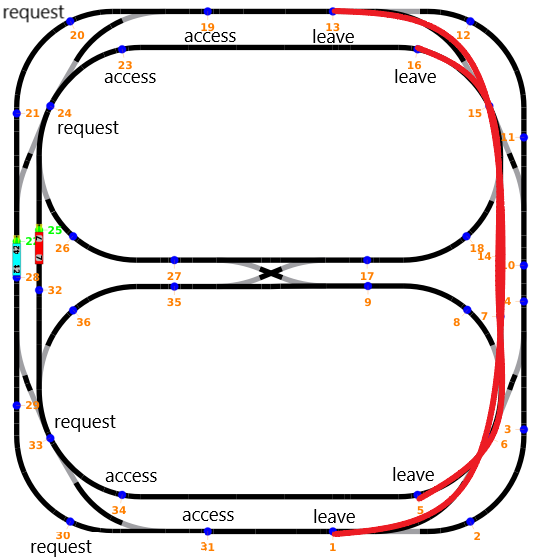
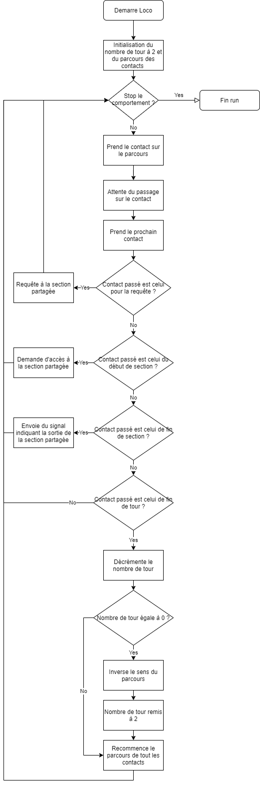
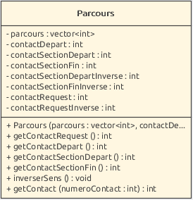
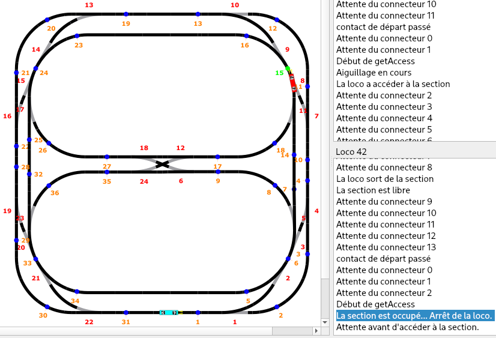
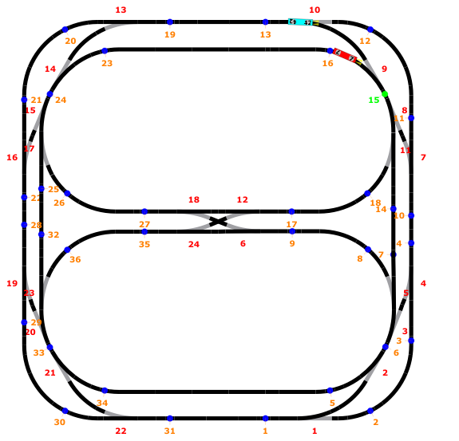
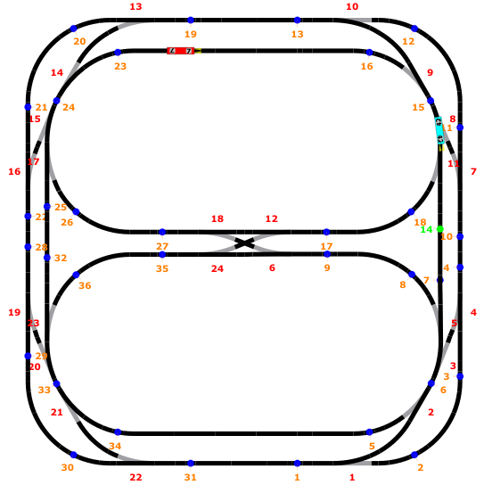
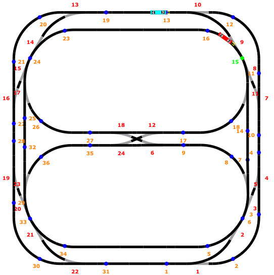

# Labo 5 : Gestion de ressources

Auteurs: Müller Robin, Teixeira Carvalho Stéphane

## Description des fonctionnalités du logiciel

Lors de ce laboratoire, il nous a été demandé d'implémenter de la gestion de ressources entre thread à l'aide de sémaphore dans une application de simulation de parcours de locomotive.  

Cela était nécessaire car les locomotives font chacunes un parcours circulaire et il était demandé qu'un tronçon soit le même pour les 2 locomotives de la simulation, nous appelerons cela la section partagée. Comme les locomotives ne peuvent pas être en même temps sur ce tronçon, elles devront se partager la ressource.

Pour le premier programme, nous devons faire rouler les locomotives pendant 2 tours dans un sens puis lors du deuxième tour celle-ci doivent repartir dans le sens inverse pour ensuite effectuer à nouveau deux tours pour rechanger de sens et cela à l'infine.

Comme les deux locomotives partagent un tronçon en commun, elles devront demander l'accès au tronçon avant d'arriver dans celui-ci. Si une locomotive est déjà dans le tronçon la locomotive ayant fait la demande d'accès s'arrête et attend que le tronçon soit libre(locomotive dans le tronçon en sort). Sinon, elle rentre dans la section et la section se retrouve alors fermée tant que celle-ci se trouve à l'intérieur.

Dans la deuxième partie, il était demandé d'effectuer un second programme sur la base du premier en implémentant cette fois-ci une notion de priorité. Pour cela les locomotives devront effectuées une requête avant de faire la demande d'accès implémentée dans le premier programme. Ainsi, si la locomotive lors de la demande d'accès à une priorié plus basse qu'une locmotive venant d'effectuer une requête d'accès. Elle se retrouve alors arrêtée et doit attendre que la locomotive de priorité plus haute finisse de passer dans la section partagée avant de pouvoir y entrer.

Le tronçon partagé que nous avons choisi pour les deux programmes est celui tracé en rouge dans l'image ci-dessous:


Les différents contacts utiisler par notre programme pour définir les actions a effectués osnt accompagnés d'une légende.

## Choix d'implémentation

En prenant en compte les fonctionnalités que le problème expliqué ci-dessus comporte, voici comment nous avons implémenté la solution.

Dans un premier temps nous avons décidé de schématiser le comportement des locomotives. Voici le flowchart expliquant le fonctionnement.



Sur le schéma nous pouvons voir qu'une `locomotive` démarre en initialisant 2 variables : le nombre de tour que la locomotive doit effectuer avant d'inverser de sens et le numéro du contact que nous désirons sur le parcours(un parcours sera une liste de contact  et donc il nous faut un index pour parcourir la liste).

La `locomotive` va ensuite effectuer son parcours tant que son comportement ne doit pas être stoppé. S'il est stoppé le thread se termine. Attention, si on demande un arrêt lors de l'attente du contact, le thread ne se termine pas correctement.

Si le stop n'est pas actif la `locomotive` va tout d'abord prendre le contact désiré de la liste et attendre que celui-ci soit atteint. Une fois le contact passé la variable avec le numéro de contact sera incrémentée pour prendre le contact suivant dans la liste pour la prochaine itération.

Nous effectuons ensuite plusieurs tests pour savoir si le contact passé est un contact pour lequel une action doit être effectuée. Les 3 premiers tests permettent d'appeler les fonctions de la section partagée(Dans l'ordre  des tests `request`, `getAccess` et `leave`).

Le dernier test permet de savoir si un tour a été effectué par la `locomotive`. Si cela est le cas on va décrementer le nombre de tour et si celui-ci se retrouve à 0 nous allons inverser le sens du parcours(liste de contact doit être inversée) ainsi que celui de la `locomotive`. Puis, Le nombre de tour sera alors remis à deux et le numéro de contact remis à zéro. Sinon, si le nombre de tour est différent de 0, nous allons simplement réinitialiser la variable des numéro de contact du parcours car dans tout les cas le parcours sera recommencé.

Lors de la conception du programme nous nous sommes rendus compte qu'il serait intéressant d'ajouter une classe supplémentaire se nommant `Parcours`. Elle nous permet d'avoir tous les contacts qu'une locomotive doit passer ainsi que les contacts importants lors du tour effectué.

Voici un schéma UML de notre classe Parcours :



Comme indiqué auparavant cette classe permet de définir toutes les spécificités d'un parcours effectué par une locomotive. Le constructeur de cette classe initialise tous les attributs privés. Nous définissons également tous les contacts spéciaux pour le parcours inverse car les contacts sont différents et ainsi il est plus simple pour nous d'échanger les valeurs lorsqu'il y a un changement de sens. Il nous suffit de faire un swap entre les valeurs.

```cpp
void Parcours::inverserSens()
{
    // Inverse toute les valeurs du vecteur sauf le dernier contact qui est le contact de départ du parcours
    std::reverse(parcours.begin(), parcours.end() - 1);
    // Swap les valeurs des contacts entre les contacts du parcours en sens inverse et normal
    std::swap(contactSectionDepart,contactSectionDepartInverse);
    std::swap(contactSectionFin,contactSectionFinInverse);
    std::swap(contactRequest, contactRequestInverse);
}
```
 La classe propose également des getteurs pour les différents contacts importants lors du parcours.  
 Ces contacts sont les contacts :
 1. Où la requête doit être effectuée
 2. Où la demande d'accès doit être effectuée
 3. Oû la locomtive sort de la section partagée
 4. Indiquant la fin d'un tour

Ainsi, si nous reprenons le flowchart du comportement d'une locomotive lorsque nous allons tester les actions à faire selon le contact passé, nous allons simplement faire appel aux getteurs de la classe Parcours. Il va de soit que la classe `LocomotiveBehavior` aura alors un objet Parcours en tant qu'attribut pour appeler ces getteurs.

Voici le constructeur de `LocomotiveBehavior`:
```cpp
LocomotiveBehavior(Locomotive& loco, std::shared_ptr<SharedSectionInterface> sharedSection,
                   Parcours parcours, SharedSectionInterface::Priority priority)
                   : loco(loco), sharedSection(sharedSection), parcours(parcours), priority(priority)
```

Lors de la conception de la classe SharedSection nous avons utilisé les attributs privés suivants :
```cpp
bool accesPrioritaire;
bool sectionOccupee;
bool locoEnAttente;

PcoSemaphore wait;
PcoSemaphore mutex = PcoSemaphore(1);

static bool stop;
static PcoSemaphore mutexStatic;
```
Le booléean `accesPrioritaire` va nous permettre de savoir si une locomotive avec un accès prioritaire a demandé accès au tronçon.  
Elle sera mise à `true` lors d'un getRequest d'une locomotive ayant une priorité élevée(HighPriority) et ensuite à false quand une locomotive de haute priorité quitte(`leave`) la section partagée.

Nous avons ensuite défini un booléean `sectionOccupee` qui va permettre de savoir si une locomotive se trouve sur le tronçon partagée car si cela est le cas la variable sera à `true` et toutes les locomotives qui essayeront d'entrer dans la section seront alors en mise en attente. Cette variable sera alors remis à `false` lorsque la locomotive se trouvant dans le tronçon en sort.

Une troisième variable booléenne se nommant `locoEnAttente` va permettre au programme de savoir si une locomotive a été mise en attente la variable sera mise a `true` dans ce cas là. Pour rappel, une locomotive est mise en attente si le tronçon est occupée ou que une locomotive de priorité supérieur a demandée accès au tronçon. Ainsi lorsque la locomotive qui était dans le tronçon en sort elle saura si elle doit relâcher une locomotive ou non.

Nous avons pu mettre en place cette variable booléenne car il nous a été demandé de faire une implémentation pour les 2 locomotives qui nous étaient données et non pas une implémentation pour N locomotives car sinon cette variable aurait dû être remplacé par un entier.

Ensuite la sémaphore `wait` va permettre aux locomotives d'attendre(`acquire`) ou de libérer(`release`) la section partagée.  

Un `mutex` a été défini car les threads devront se partagées des variables et nous devons donc mettre en place de l'exclusion mutuelle pour éviter d'avoir des problèmes de concurrences.

La variable statique booléenne `stop` va nous permettre d'indiquer(depuis le main) à la section partagée de se terminer et donc de ne plus prendre de locomotive dans le tronçon.

Nous avons également créer la même variable statique `stop` dans le `LocomotiveBehavior` pour permettre au main d'arrêter le comportement des locomotives.

Les 2 classes auront alors une fonction statique publique se nommant void static `stopAllBehaviors()` pour LocomotiveBehavior et `stopShared()` pour SharedSection pour stopper les threads depuis le main.

Nous avons dû implémeneter des fonctions statiques car la fonction `emergency_stop` dans le main ne connaissait pas d'objet instancié sous la forme de LocomotiveBehavior ou encore SharedSection. Et comme la fonction ne prennait également aucun paramètre le seul moyen que nous avions de stopper les threads était de créer ces fonctions statiques.

Malheureusement, même avec le stop implémenté nous avons toujours des problèmes a terminer le programme correctement car la fonction `attendre_contact` dans le LocomotiveBehavior est bloquant. Il se pourrait que nous arrêtons le parcours(`emergency_stop`) alors que la locomotive se situe dans la fonction attendre_contact et donc dans ce cas le thread ne se termine pas car il est bloqué dans la fonction. Afin de garantir que le LocomotiveBehavior ne continue pas après un arrêt d'urgence, un second if détecte l'arrêt après `attendre_contact`.


## Tests effectués
Afin de valider nos programmes, tous les tests ont été effectués avec et sans inertie.

Nous avons tester les 2 programmes de la manière suivante :

### Tests programme 1
#### Vitesse de base (loco 7 - vitesse 10 et loco 42 - vitesse 12)
Ce test permet de valider les critères de base du programme. Le comportement a été analysé pendant 8 tours et est conforme aux spécifications.

Au premier accès de la section partagée, la loco 7 passe avant la loco 42, car elle est la première à atteindre son connecteur d'accès de section.

La capture d'écran suivante montre l'arrêt de la loco lorsque la section est occupée :



#### Vitesse de base (loco 7 - vitesse 14 et loco 42 - vitesse 16)
Ce test est une tentative avec une vitesse de locomotive plus élévé que prévu par les limites du système. Ceci nous permet donc de tester un cas limite.

Le test ne passe pas avec l'inertie activée. En effet, la locomotive prends trop de temps pour s'arrêter et entre dans le section partagée. On peut le voir avec l'arrêt de la loco 42 sur la capture ci-dessous :



Le test avec inertie fonctionne sans problème. Comme ces vitesses sortent des spécifications du système, l'échec de ce test ne pose pas de problème.

### Tests programme 2

#### Test avec priorités standards
La vitesse de la loco 7 est de 10 et sa priorité est basse. La loco 42 à une vitesse de 12 et une priorité haute.

Lors du test de la partie 1, la loco 7 passe la section partagée avant la loco 42. Cette fois-ci, la 42 devrait passer en premier à cause des priorités. On voit que c'est bien le cas :



Le test a été validé après 8 tours.

#### Test avec deux priorités hautes
La première locomotive demandant l'accès à la section devrait pouvoir y accéder. Ce test est utilisé pour cela.

Comme expliqué précédemment, la loco 7 effectue ses demandes avant la loco 42 lors du démarrage, la 7 devrait donc passer avant.

On voit sur la capture d'écran suivante que le test passe :



Le test a été continué et validé après 8 tours.

#### Test avec deux priorités basses
Le comportement de ce test est identique aux priorités hautes donc le test passe.
