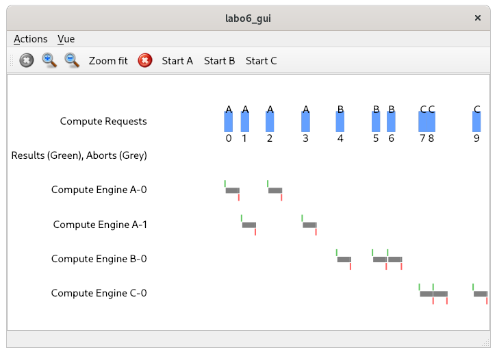
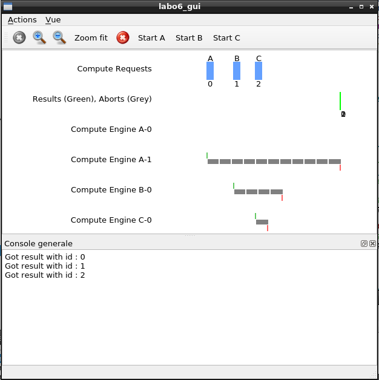
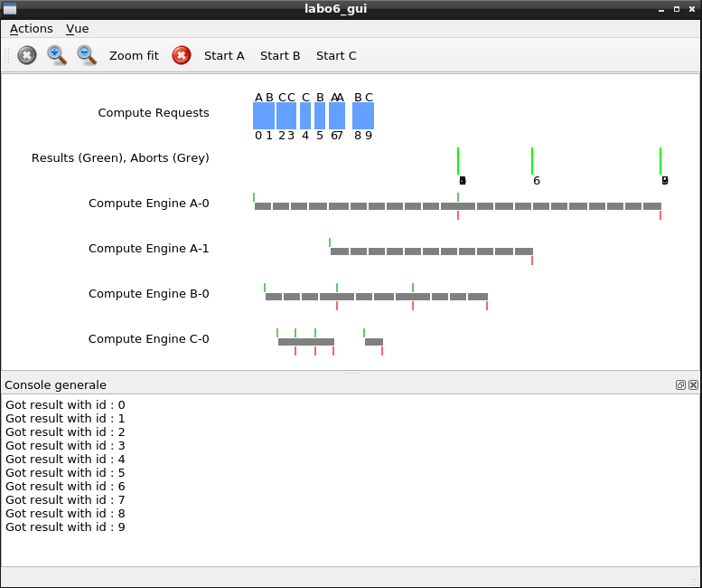
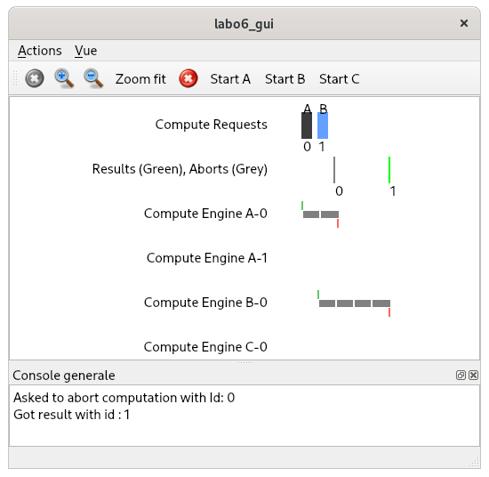
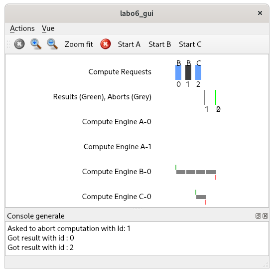
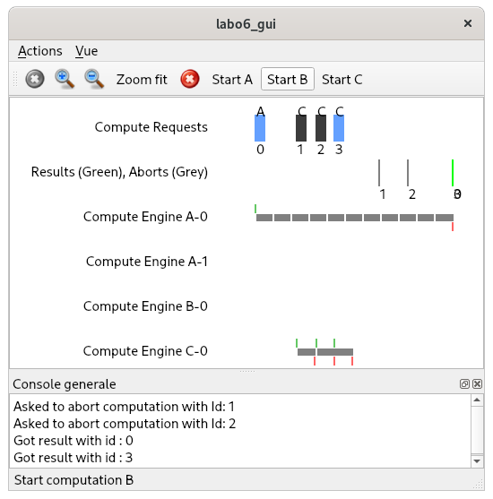
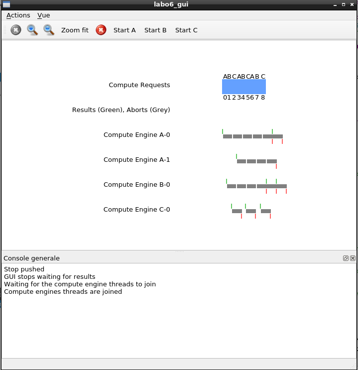
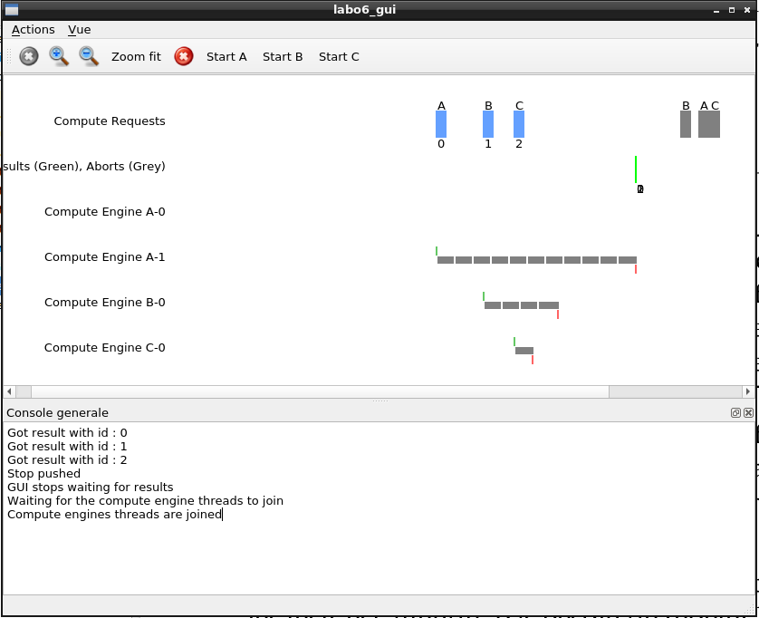

# Labo 6 : Producteur-Consommateur pour calcul différé

Auteurs: Müller Robin, Teixeira Carvalho Stéphane

## Etape 1
### Conception
La première étape du programme consiste a créé les fonctions requestComputation et getWork.

La méthode `requestComputation` est potentiellement bloquante car il ne peut avoir que n computations par type(dans le programme fourni 10). Nous utilisons donc un `std::vector<Condition> conditionsFull`. Ce vecteur permet de stocker une variable de condition par type de computation. On effectue donc un wait sur cette variable s'il y a 10 computations car le nombre maximal de computation a été atteint. La méthode `getWork` envoie ensuite un signal au bon type lorsqu'une computation est récupérée.

Afin de stocker les différentes computations, nous avons décidé d'utiliser une `map` en prévision des futures fonctions. La déclaration est la suivante : `std::map<int, Computation> computations`.  
L'index de la map contient l'id afin d'obtenir une computation en fontion de son id rapidement. Ceci sera très utile dans le cas de `abortComputation` .   
L'utilisation d'une `std::map` permet également d'avoir un conteneur trié en fonction de l'id.

Il nous faut encore un conteneur pour stocker les ids pour chaque type de computation et obtenir le prochain id. Nous avons utilisé le type suivant : `std::vector<std::set<int>> computation` .   
Ce vecteur de set nous permet de stocker la computation avec l'id le plus petit, ainsi que de supprimer les computations en `log(n)`. Ceci nous sera utile dans les étapes futures.

Code de `requestComputation` :
```C
int ComputationManager::requestComputation(Computation c) {
    monitorIn();
    // Stock le type de computation en int afin de simplifier le code
    int cType = (int)c.computationType;
    // Si le buffer du type de computation est plein, on wait
    if(computation[cType].size() == MAX_TOLERATED_QUEUE_SIZE){
        wait(conditionsFull[cType]);
    }
    // Insertion de la computation
    int id = nextId++;
    computations.insert(std::make_pair(id, c));
    computation[cType].insert(id);

    // Envoie d'un signal si une thread attendait car buffer vide
    signal(conditionsEmpty[cType]);
    monitorOut();
    checkStop();
    return id;
}
```

Pour la méthode getWork, il est aussi nécessaire d'avoir un vecteur de variables de conditions : `std::vector<Condition> conditionsEmpty`. Ceci permet d'attendre lorsqu'aucune computation du bon type n'est disponible que le buffer est vide. Le signal est envoyé par la méthode `requestComputation` lorsqu'une computation du bon type est ajoutée.  
Cette méthode obtient l'id de la première computation et supprime l'id ainsi que la computation des conteneurs.

Code de `getWork` :
```C
Request ComputationManager::getWork(ComputationType computationType) {
    monitorIn();
    int id;
    // Stock le type de computation en int afin de simplifier le code    
    int cType = (int)computationType;
    // Attente si le buffer du type est vide
    if(computation[cType].size() == 0){
        wait(conditionsEmpty[cType]);
    }
    // Récupère l'id et supprime le du conteneur
    auto it = computation[cType].begin();
    id = \*it; // le backslash n'est pas présent dans le code
    computation[cType].erase(it);
    auto itComputation = computations.find(id);
    Request request = Request(itComputation->second, id);
    computations.erase(itComputation);
    // Signal une thread qui attendait car buffer plein
    signal(conditionsFull[cType]);
    monitorOut();
    return request;
}
```

### Tests

Pour valider cette étape nous avons utiliser les test proposées ainsi qu'un test avec le GUI.

Maintenant que ces deux méthodes sont implémentées, le GUI devrait être capable de créer des computations de tout les types ainsi qu'obtenir leurs ids. Les compute engines quand à eux doivent être capable de récupérer des computations.



On voit donc que notre première étape est fonctionnel.
</br>
## Etape 2

### Conception
Dans un premier temps nous avons dû ajouter les variables suivantes pour mener à bien l'étape 2 :
```cpp
Condition resultsEmpty;
Condition resultsMinId;
std::map<int, Result> results;
int minId;
```
Nous avons ajouter 2 conditions `resultsEmpty` et `resultsMinId` pour que la fonction `getNextResult()` soit bloquante. Une condition va nous permettre d'arrêter le thread lorsque le buffer de résultat est vide et la seconde va nous permettre d'attendre jusqu'à ce que le résultat avec l'id le plus ancien(id minimal) arrive en tant que résultat.

Nous avons ensuite défini une map `results` allant contenir une paire `id->résultat` ainsi, nous aurons tout les résultat dans l'ordre croissant des id. Nous avons utilisé une map car ainsi il est simple de faire une attente sur l'id minium et nous savons alors que cet id sera toujours le premier. Nous pouvons aussi grâce a cette structure lié un résultat à un id.

L'entier `minId` va permettre de savoir quel est le prochain id attendu pour transmettre le résultat.

Voici donc ce que donne la fonction provideResult :
```cpp
void ComputationManager::provideResult(Result result) {
    monitorIn();
    results.insert(std::make_pair(result.getId(), result));
    // A cause du fait que le thread reveille prend la main
    if(results.size() == 1){
        signal(resultsEmpty);
    }
    if(results.begin()->first == minId){
        signal(resultsMinId);
    }
    monitorOut();
}
```
Comme expliqué au-dessus la map results va nous permettre de maintenir une liaison id->résultat et donc nous allons tout d'abord ajouter le nouveau résultat avec son id dans la map.

Puis, si la taille de results vaut 1 (ce qui veut dire qu'elle était vide auparavant) ou que le résultat obtenu est bien le résultat à l'id attendu nous allons envoyer un signal sur l'une des conditions qui pourrait bloquer un thread dans la fonction getNextResult().

Voici la fonction getNextResult :
```cpp
Result ComputationManager::getNextResult() {
    monitorIn();
    if(results.size() == 0){
        wait(resultsEmpty);
    }
    while(results.begin()->first != minId){
        wait(resultsMinId);
    }
    minId++;
    Result result = results.begin()->second;
    results.erase(results.begin());
    monitorOut();

    return result;
}
```
Comme indiqué dans la donnée la fonction getNextResult doit être bloquante. Elle doit bloquer lorsqu'aucun résultat n'est parvenu(`results.size() == 0`) ou lorsque le résultat n'est pas la suite direct du dernier resulat envoyé(`results.begin()->first != minId`).

Si l'un de ces deux cas s'avère vrai la fonction va attendre sur les conditions que nous avons créée.

Une fois ces 2 conditions passées nous incrémentons `minId` pour spécifier le prochain id que getNextResult devra retourner. Puis, nous enlevons le résultat de la map pour ensuite le retourner.

### Tests

Pour valider cette étape nous avons utiliser les test proposées et des tests avec la GUI expliqué ci-dessous :

#### Test 1

Dans un premier temps nous avions testé le cas où nous envoyons une tâche de chaque type. Mais ce test ne fonctionnait pas car il y avait un problème dans le ComputeEngine des computation A et B.

Pour corriger cela il fallait modifier la valeur de retour de la fonction continueWork et mettre true.

Voici donc le résultat après la modification



On voit alors que même si les computation B et C se terminent avant A le programme attend que A se termine avant d'afficher les requests.

<div style="page-break-after: always;"></div>

#### Test 2

Dans ce cas, nous avons augmenter le nombre de computation en variant les computations.



Le test est correct car les id sont dans retournés l'ordre comme désiré

#### Test supplémentaires

Nous avons ensuite continuer d'augmenter le nombre de computations et vérifier si les id restait dans l'ordre.

| # | Nb computations | Computation par type | Ordre correct   |
|---|------------|----------|------------|
| 1 | 15         | 5        | OK      |
| 2 | 30         | 10       | OK      |
| 3 | 45         | 15       | OK      |
| 4 | 60         | 20       | OK      |
| 5 | 75         | 25       | OK      |


## Etape 3
Cette étape implémente les fonctions `abortComputation` et `continueWork`.  

Afin de les faire fonctionner proprement, plusieurs structures ont été ajoutées :
- `std::vector<int> nbWaitingFull` : Ce vecteur permet de maintenir un compteur pour chaque type de computation lorsque le buffer du type est plein. On l'incrémente juste avant le wait lorsque le buffer est plein pour le type de computation demandé. Ceci nous permet également de modifier la fonction `getWork` et d'envoyer un signal seulement si une thread est en attente.
- `std::vector<int> nbWaitingEmpty` : Ce vecteur permet de maintenir un compteur pour chaque type de computation lorsque le buffer du type est vide. On l'incrémente juste avant le wait lorsque le buffer est vide pour le type de computation demandé. Ceci nous permet également de modifier la fonction `requestComputation` et d'envoyer un signal seulement si une thread est en attente.
- `std::set<int> abortedId` : Afin de maintenir une liste des ids annulés, un set est utilisé pour supprimer et ajouter des id en `log(n)`.

<div style="page-break-after: always;"></div>

Le code de notre fonction abortComputation est le suivant :
```C
void ComputationManager::abortComputation(int id) {
    monitorIn();
    // Effacer de la liste des computations
    auto itComputation = computations.find(id);
    // Effacer de la liste des résultat
    auto itResult = results.find(id);

    // On ajoute uniquement les ids valide
    if(id < nextId || id >= minId){
        abortedId.insert(id);
    }

    // Si l'id a été trouvé dans la liste des computations
    if(itComputation != computations.end()){
        int cType = (int)itComputation->second.computationType;
        // Trouve l'id a supprimer du set
        auto it = std::find(computation[cType].begin(), computation[cType].end(), id);
        // Efface la computation trouvée de la map et du set
        computations.erase(itComputation);
        computation[cType].erase(it);
        // Si un thread était en attente, on le libère
        if(nbWaitingFull[cType] > 0){
            nbWaitingFull[cType]--;
            signal(conditionsFull[cType]);
        }
    // Si l'id a été trouvé dans la liste des résultats
    } else if(itResult != results.end()){
        results.erase(itResult);
    } else {
        // Si on supprime le minId, on l'incrémente et on libère un thread
        if (id == minId) {
          minId++;
          signal(resultsMinId);
        }
    }

    monitorOut();
}
```
La fonction commence par rechercher l'id de la computation à annuler dans `computations` et dans `results`.  
On ajoute ensuite l'id dans la liste des ids abortés. Ceci permet à la fonction `continueWork` de retourner faux et à `getNextResult` d'ignorer les ids abortés.

Il y a ensuite trois possibilités :

1. Si la computation est trouvée dans la liste de computations, cela signifie qu'aucun `computeengine` effectue actuellement des calculs. On supprime donc simplement l'id des structures et on libère une thread si le buffer était plein.

2. Si 1 est faux et que l'id à annuler se trouve dans les résultats, on supprime le résultat du conteneur.

3. Si 1 et 2 sont faux, on est alors en cours de calcul. On regarde si l'id a annulé est égal au `minId`. Dans ce cas là, on incrémente l'id et envoie un signal à la fonction `getNextResult` si une thread attendait le `minId`.

Fonction `continueWork` :
```C
bool ComputationManager::continueWork(int id) {
    bool work;
    monitorIn();
    work = abortedId.find(id) == abortedId.end();
    monitorOut();
    return work;
}
```
La fonction `continueWork` retourne vrai si l'id n'a pas été annulé, faux sinon.


Le code suivant a été ajouté à la fonction `getNextResult` :
```C
    // Supprime les id abortés et augmente minId
    while (abortedId.size() > 0 && *abortedId.begin() == minId) {
        abortedId.erase(abortedId.begin());
        minId++;
    }
```
Ceci permet d'ignorer les ids annulés.

### Tests

Pour valider cette étape nous avons utiliser les test proposées et des tests avec la GUI expliqué ci-dessous :

Avec la GUI, nous devrions être capable d'utiliser toutes les fonctionnalités à l'exception de l'arrêt.

#### Annulation d'une computation en cours de calcul
Afin de vérifier le fonctionnement de l'annulation, une computation A est lancée ainsi qu'une computation B. On annule ensuite la computation A.

On ne devrait pas obtenir de résultat A mais un résultat pour B. La capture d'écran suivante valide le test:  


#### Annulation d'une computation en attente
On lance le test de la façon suivante :
1. Lancement d'une première computation B (id = 0)
2. Lancement d'une seconde computation B (id = 1)
3. Lancement d'une computation C (id = 2)
4. Annulation de la seconde computation B

On ne devrait pas obtenir de résultat avec l'id 1 mais des résultats pour les ids 0 et 2. La capture d'écran suivante valide le test:  


#### Annulation d'une computation terminée
On lance le test de la façon suivante :
1. Lancement d'une première computation A (id = 0)
2. Lancement de trois computations C (id = 1, 2, 3)
3. On attend que les trois computations C se terminent
3. Annulation des computations avec les ids 1 et 2

Une fois que A se termine, on doit obtenir le résultat des computations
On ne devrait pas obtenir de résultat avec l'id 1 ou 2 mais des résultats pour les ids 0 et 3. La capture d'écran suivante valide le test:  


<div style="page-break-after: always;"></div>

## Etape 4

### Conception

Pour cette étape, nous n'avons pas ajouté de variables supplémentaires.

Nous avons effectués les actions suivantes dans la fonction stop :
```cpp
void ComputationManager::stop() {
    stopped = true;
    monitorIn();
    signal(resultsEmpty);
    signal(resultsMinId);
    int type = 0;
    for(Condition &c : conditionsFull){
        while(nbWaitingFull[type] > 0){
            signal(c);
            nbWaitingFull[type]--;
        }
        type++;
    }
    type = 0;
    for(Condition &c : conditionsEmpty){
        while(nbWaitingEmpty[type] > 0){
            signal(c);
            nbWaitingEmpty[type]--;
        }
        type++;
    }
    monitorOut();
}
```
Nous avons décidé de ne pas mettre stopped en section critique car le seul endroit où la variable est modifiée est dans cette fonction.

Nous envoyons ensuite des signaux à toutes les conditions que nous avons créer auparavant pour libérer tout les threads qui seraient bloquer pour pouvoir les arrêter.

Pour ne pas avoir un code répétitif pour arrêter les threads correctement nous avons ensuite créer 2 fonctions :

```cpp
void ComputationManager::checkStop(){
  if(stopped){
      monitorOut();
      throwStopException();
  }
}
```

Cette fonction permet de vérifier si un stop a été effectué. Si cela est le cas, la fonction libère le moniteur et renvoie l'exception indiqué dans la donnée. Sinon elle ne fait rien. On peut effectuer un monitorOut car cette fonction sera toujours appelé par une fonction ou un monitorIn a déjà été effectué.

```cpp
void ComputationManager::waitCheckStop(Condition &c){
    checkStop();
    wait(c);
    checkStop();
}
```
Nous avons créer cette fonction pour éviter de devoir écrire ces 3 lignes de code partout ou il y aurait des wait. Ainsi dans tout les endroits où nous avions des wait nous effectuons maintenant `waitCheckStop(condition)`.

Nous effectuons un checkStop avant le wait pour éviter que l'on ait une famine. Si cela n'était pas vérifier nous pourrions avoir un thread qui arrive alors que le programme a déjà effectué la fonction stop et il resterait bloquer dans la fonction wait car plus aucun signal ne serait envoyé.

Le deuxième `checkstop` permet, si le programme a été stoppé, de quitter le moniteur et d'arrêter l'exécution du thread en renvoyant une exception si un signal a été reçu et fait srotir le thread du wait.

Nous avons également ajouter un checkStop en tout début de la fonction car si le programme est arrêté plus aucune computation de doit être acceptée.

```cpp
int ComputationManager::requestComputation(Computation c) {
    monitorIn();
    checkStop();
...
```

Nous avons également dû modifier la condition de continueWork pour qu'après un stop celle-ci renvoie toujours false:
```cpp
work = abortedId.find(id) == abortedId.end() && !stopped;
```

Nous avons ajouter la condition `!stopped` ainsi si `stopped` passe a true work sera toujours a false et la fonction continueWork renverra toujours false.


### Tests

Pour valider cette étape nous avons utilisé les test proposés et des tests avec la GUI expliqué ci-dessous :

#### Test 1

Avec la GUI nous avons tout d'abord tester le fonctionnement de base qui est d'arrêter le programme au bout d'un certain temps alors que des computation sont en cours.



Dans un premier temps on peut voir que le programme arrête bien les computations directement dès que le signal stop est envoyé. Le signal stop a été envoyé juste après la demande de computation 8.

Si on regarde dans le terminal on voit également que les compute engines sont bien stopper.
```
GUI Enabled : 0
[STOP] Compute Engine A - 0
GUI Enabled : 1
[STOP] Compute Engine A - 1
GUI Enabled : 2
[STOP] Compute Engine B - 0
GUI Enabled : 3
[STOP] Compute Engine C - 0
```

#### Test 2

Nous avons ensuite effectué un 2ème test pour vérifier que le programme n'accepte plus de computation après un arrêt.



Le test est fonctionnel car on voit que les computations B, A, C sont grisés ce qui indique qu'il n'est plus possible d'effectuer une computation.
